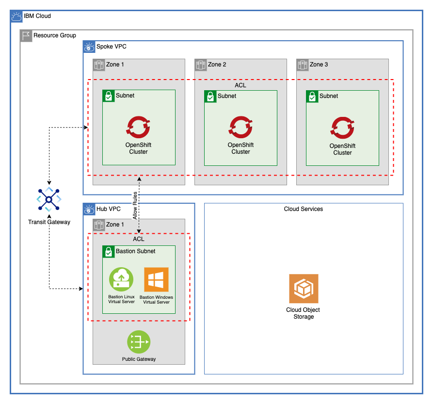

# Multi-zone VPCs connecting using Transit Gateway

This module creates two multitier VPCs and connects them via [IBM Cloud Transit Gateway](https://cloud.ibm.com/docs/transit-gateway?topic=transit-gateway-getting-started). It creates a ROKS cluster on the spoke VPC, and bastion VSI on the hub VPC.



---

## Table of Contents

1. [Spoke VPC](##Spoke-vpc)
    - [Spoke VPC Access Control List](###Spoke-VPC-Access-Control-List)
2. [Hub VPC](##hub-vpc)
    - [Hub VPC Access Control List](###Hub-VPC-Access-Control-List)
3. [Bastion VSI](##Bastion-VSI)
    - [Linux VSI and NLB Proxy](###Linux-VSI-and-nlb-proxy)
    - [Windows VSI](###Windows-VSI)
4. [Transit Gateway](##transit-gateway)
5. [Testing](##testing)
6. [Module Variables](##Module-Variables)
7. [Module Outputs](##Module-Outputs)

---

## Spoke VPC

This module creates a VPC with any number of subnets across 1, 2, or 3 zones. These subnets are where the OpenShift cluster will be provisioned.

The VPC resources can be found in the [multizone_vpc](/multizone-vpc) folder. For more information, see the [multizone_vpc README](/multizone-vpc/README.md).

-----

### Spoke VPC Access Control List

The VPC in this template uses an Access Control List to direct traffic. This traffic pattern is based on the [OpenShift VPC Network Policy Documentation](https://cloud.ibm.com/docs/openshift?topic=openshift-vpc-network-policy#acls). ACL rules are created in [acl_rules.tf](./acl_rules.tf).

The following ACL Rules are created automatically on provision:

#### Spoke VPC Static ACL Rules

These ACL rules will be automatically created for the VPC regardless of subnet CIDR blocks:

Direction | Rule                                                          | Allow / Deny | Protocol | Source         | Source Port   | Destination   | Desination Port
----------|---------------------------------------------------------------|--------------|----------|----------------|---------------|---------------|-----------------
Inbound   | Allow Worker Nodes to be Created                              | Allow        | All      | 161.26.0.0/16  | -             | 0.0.0.0/0     | -
Inbound   | Allow communication to Services over Private Service Endpoint | Allow        | All      | 166.8.0.0/14   | -             | 0.0.0.0/0     | -
Inbound   | Allow incoming traffic requests to apps on worker nodes       | Allow        | TCP      | 0.0.0.0/0      | 30000 - 32767 | 0.0.0.0/0     | -
Inbound   | Allow load balancer and ingress app incoming traffic          | Allow        | TCP      | 0.0.0.0/0      | Any           | 0.0.0.0/0     | 443
Outbound  | Allow Worker Nodes to be Created                              | Allow        | All      | 0.0.0.0/0      | -             | 161.26.0.0/16 | -
Outbound  | Allow communication to Services over Private Service Endpoint | Allow        | All      | 0.0.0.0/0      | -             | 166.8.0.0/14  | -
Outbound  | Allow incoming traffic requests to apps on worker nodes       | Allow        | TCP      | 0.0.0.0/0      | 30000 - 32767 | 0.0.0.0/0     | -
Outbound  | Allow load balancer and ingress app incoming traffic          | Allow        | TCP      | 0.0.0.0/0      | Any           | 0.0.0.0/0     | 443

#### Spoke Dynamic ACL Rules

For each subnet in the hub VPC, a rule is created to allow inbound and outbound traffic from that subnet. In addition, a rule is created to allow all traffic to the Spoke VPC subnet. Here is an example of the dynamically created rules using the CIDR blocks found in [variables.tf](variables.tf).

Direction | Allow / Deny | Protocol | Source         | Source Port   | Destination    | Desination Port
----------|--------------|----------|----------------|---------------|----------------|-----------------
Inbound   | Allow        | All      | 10.90.10.0/24  | -             | 0.0.0.0/0      | -
Outbound  | Allow        | All      | 0.0.0.0/0      | -             | 10.10.90.0/24  | -

#### Adding Additional Rules

The `multizone_vpc` module accepts an `acl_rules` argument that allows for the creation of additional ACL rules. For this example, rules to deny all other inbound and outbound traffic are added:

Direction | Allow / Deny | Protocol | Source         | Source Port   | Destination    | Desination Port
----------|--------------|----------|----------------|---------------|----------------|-----------------
Inbound   | Deny         | All      | 0.0.0.0/0      | -             | 0.0.0.0/0      | -
Outbound  | Deny         | All      | 0.0.0.0/0      | -             | 0.0.0.0/0      | -

---

## Hub VPC

This module creates a VPC with any number of subnets across 1, 2, or 3 zones. By default, a single subnet is created in zone one. This subnet is where the [Bastion VSI](##bastion-vsi) will be provisioned.

The VPC resources can be found in the [multizone_vpc](/multizone-vpc) folder. For more information, see the [multizone_vpc README](/multizone-vpc/README.md).

---

### Hub VPC Access Control List

The VPC in this template uses an Access Control List to direct traffic. This traffic pattern is based on the [OpenShift VPC Network Policy Documentation](https://cloud.ibm.com/docs/openshift?topic=openshift-vpc-network-policy#acls).

The following ACL Rules are created automatically on provision:

#### Hub VPC Dynamic ACL Rules

For each subnet in the spoke VPC, a rule is created to allow inbound and outbound traffic from that subnet. In addition, a rule is created to allow all traffic to the Spoke VPC VSI subnet. Here is an example of the dynamically created rules using the CIDR blocks found in [variables.tf](variables.tf).

Direction | Allow / Deny | Protocol | Source        | Source Port   | Destination    | Desination Port
----------|--------------|----------|---------------|---------------|----------------|-----------------
Inbound   | Allow        | All      | 0.0.0.0/0     | -             | 10.10.10.0/24 | -
Inbound   | Allow        | All      | 0.0.0.0/0     | -             | 10.20.10.0/24 | -
Inbound   | Allow        | All      | 0.0.0.0/0     | -             | 10.30.10.0/24 | -
Outbound  | Allow        | All      | 10.10.10.0/24 | -             | 0.0.0.0/0      | -
Outbound  | Allow        | All      | 10.20.10.0/24 | -             | 0.0.0.0/0      | -
Outbound  | Allow        | All      | 10.30.10.0/24 | -             | 0.0.0.0/0      | -

#### Adding Additional Rules

The `multizone_vpc` module accepts an `acl_rules` argument that allows for the creation of additional ACL rules.

---

## ROKS Cluster

This module creates a Red Hat OpenShift Cluster across all the subnets created for the [Spoke VPC](##VPC) except for the proxy subnet. This module can also dynamically create additional worker pools across the subnet.

---

## Bastion VSI

This module creates two VSI in the [Hub VPC](###Hub-VPC). A linux VSI that uses terraform to create an NLB proxy, and a Windows VSI. Both of these instances can be used to manage the OpenShift cluster.

For each VSI, a floating IP is created to allow connection from your local machine.

---

### Linux VSI and NLB Proxy

This VSI to create an NLB Proxy to allow access to the cluster via the Private Service Endpoint. To read more about accessing the cluster through a private service endpoint refer to the [documentation here](https://cloud.ibm.com/docs/containers?topic=containers-access_cluster#access_private_se).

The virtual server by default uses the [install_terraform_vsi](./bastion_vsi/scripts/install_terraform_vsi.sh) script to install terraform, write the script inside the VSI, and run the script.

In addition, the IBM Cloud CLI, kubectl CLI, and OpenShift CLI are installed inside the VSI to test connectivity.

The VSI is created in [bastion_vsi/linux_vsi_and_nlb_proxy.tf](./bastion_vsi/linux_vsi_and_nlb_proxy.tff)

To view the code that will be installed on the VSI, refer to the [./bastion_vsi/scripts/nlb_terraform](./bastion_vsi/scripts/nlb_terraform) folder.

---

### Windows VSI

The windows VSI uses user data to install `chocolatey` and `kubectl`. Use this script to install the IBM Cloud CLI onto your Windows instance:

```ps:
[Net.ServicePointManager]::SecurityProtocol = [Net.SecurityProtocolType]::Tls12
iex(New-Object Net.WebClient).DownloadString('https://clis.cloud.ibm.com/install/powershell')
```

For more information on connecting to your Windows instance, read the documentation [here](https://cloud.ibm.com/docs/vpc-on-classic-vsi?topic=vpc-on-classic-vsi-connecting-to-your-windows-instance)

---

## Transit Gateway

Once both VPCs have been created, an IBM Cloud Transit Gateway is created and each VPC is connected. This allows each VPC to connect as though they shared a network. In order for these connections to work, neither VPC can have any overlapping CIDR blocks. Transit Gateway resources can be found in [transit_gareway.tf](transit_gateway.tf).

---

## Testing

Use the ibmcloud and kubectl CLI to test connection from the Linux virtual server to the cluster.

From your local machine, log into the IBM Cloud CLI

```bash
ibmcloud login --sso
```

Next, download the cluster config.

```bash
ibmcloud ks cluster config --cluster <your cluster name> --admin
```

Once the certificates have been downloaded, try and get the pods from your ROKS cluster:

```bash
kubectl get pods
```

This command should fail. The public service endpoint on the cluster is disabled, and the ACL rules prevent any outside traffic from reaching the subnets where the cluster is provisioned.

In order to successfully run these commands, you will need to SSH into the Linux VSI:

First, ssh into the Linux VSI

```bash
ssh root@<linux vsi floating ip> -i <path to ssh private file>
```

Once you're inside run

```bash
kubectl get pods
```

This should result in the following message:

```
No resources found in default namespace.
```

## Module Variables

Name                     | Type                                                                                                                                                                                                                                                                                                                                                                                                                                                                                                             | Description                                                                                                                                                                                                                                                                                                                                                                                                                                                                         | Sensitive | Default
------------------------ | ---------------------------------------------------------------------------------------------------------------------------------------------------------------------------------------------------------------------------------------------------------------------------------------------------------------------------------------------------------------------------------------------------------------------------------------------------------------------------------------------------------------- | ----------------------------------------------------------------------------------------------------------------------------------------------------------------------------------------------------------------------------------------------------------------------------------------------------------------------------------------------------------------------------------------------------------------------------------------------------------------------------------- | --------- | ---------------------------------------------------------------------------------------------------------------------------------------------------------------------------------------------------------------------------------------------------------------------------------------------------------------------------------------------------------------------
ibmcloud_api_key         | string                                                                                                                                                                                                                                                                                                                                                                                                                                                                                                           | The IBM Cloud platform API key needed to deploy IAM enabled resources                                                                                                                                                                                                                                                                                                                                                                                                               | true      | 
TF_VERSION               |                                                                                                                                                                                                                                                                                                                                                                                                                                                                                                                  | The version of the Terraform engine that's used in the Schematics workspace.                                                                                                                                                                                                                                                                                                                                                                                                        |           | 1.0
prefix                   | string                                                                                                                                                                                                                                                                                                                                                                                                                                                                                                           | A unique identifier need to provision resources. Must begin with a letter                                                                                                                                                                                                                                                                                                                                                                                                           |           | gcat-multizone
region                   | string                                                                                                                                                                                                                                                                                                                                                                                                                                                                                                           | Region where VPC will be created                                                                                                                                                                                                                                                                                                                                                                                                                                                    |           | us-south
resource_group           | string                                                                                                                                                                                                                                                                                                                                                                                                                                                                                                           | Name of resource group where all infrastructure will be provisioned                                                                                                                                                                                                                                                                                                                                                                                                                 |           | gcat-landing-zone-dev
spoke_subnets            | object({ zone-1 = list(object({ name = string cidr = string public_gateway = optional(bool) })) zone-2 = list(object({ name = string cidr = string public_gateway = optional(bool) })) zone-3 = list(object({ name = string cidr = string public_gateway = optional(bool) })) })                                                                                                                                                                                                                                 | List of subnets for the vpc. For each item in each array, a subnet will be created.                                                                                                                                                                                                                                                                                                                                                                                                 |           | {<br>zone-1 = [<br>{<br>name = "subnet-a"<br>cidr = "10.10.10.0/24"<br>public_gateway = false<br>}<br>],<br>zone-2 = [<br>{<br>name = "subnet-b"<br>cidr = "10.20.10.0/24"<br>public_gateway = false<br>}<br>],<br>zone-3 = [<br>{<br>name = "subnet-c"<br>cidr = "10.30.10.0/24"<br>public_gateway = false<br>}<br>]<br>}
spoke_acl_rules          | list( object({ name = string action = string destination = string direction = string source = string tcp = optional( object({ port_max = optional(number) port_min = optional(number) source_port_max = optional(number) source_port_min = optional(number) }) ) udp = optional( object({ port_max = optional(number) port_min = optional(number) source_port_max = optional(number) source_port_min = optional(number) }) ) icmp = optional( object({ type = optional(number) code = optional(number) }) ) }) ) | Access control list rule set                                                                                                                                                                                                                                                                                                                                                                                                                                                        |           | [<br>{<br>name = "deny-all-inbound"<br>action = "deny"<br>direction = "inbound"<br>destination = "0.0.0.0/0"<br>source = "0.0.0.0/0"<br>},<br>{<br>name = "deny-all-outbound"<br>action = "deny"<br>direction = "outbound"<br>destination = "0.0.0.0/0"<br>source = "0.0.0.0/0"<br>}<br>]
hub_subnets              | object({ zone-1 = list(object({ name = string cidr = string public_gateway = optional(bool) })) zone-2 = list(object({ name = string cidr = string public_gateway = optional(bool) })) zone-3 = list(object({ name = string cidr = string public_gateway = optional(bool) })) })                                                                                                                                                                                                                                 | List of subnets for the vpc. For each item in each array, a subnet will be created.                                                                                                                                                                                                                                                                                                                                                                                                 |           | {<br>zone-1 = [<br>{<br>name = "subnet-a"<br>cidr = "10.90.10.0/24"<br>public_gateway = false<br>}<br>],<br>zone-2 = [],<br>zone-3 = []
hub_use_public_gateways  | object({ zone-1 = optional(bool) zone-2 = optional(bool) zone-3 = optional(bool) })                                                                                                                                                                                                                                                                                                                                                                                                                              | Create a public gateway in any of the three zones with `true`.                                                                                                                                                                                                                                                                                                                                                                                                                      |           | {<br>zone-1 = true<br>zone-2 = true<br>zone-3 = true<br>}
hub_acl_rules            | list( object({ name = string action = string destination = string direction = string source = string tcp = optional( object({ port_max = optional(number) port_min = optional(number) source_port_max = optional(number) source_port_min = optional(number) }) ) udp = optional( object({ port_max = optional(number) port_min = optional(number) source_port_max = optional(number) source_port_min = optional(number) }) ) icmp = optional( object({ type = optional(number) code = optional(number) }) ) }) ) | Access control list rule set                                                                                                                                                                                                                                                                                                                                                                                                                                                        |           | [<br>{<br>name = "allow-all-inbound"<br>action = "allow"<br>direction = "inbound"<br>destination = "0.0.0.0/0"<br>source = "0.0.0.0/0"<br>},<br>{<br>name = "allow-all-outbound"<br>action = "allow"<br>direction = "outbound"<br>destination = "0.0.0.0/0"<br>source = "0.0.0.0/0"<br>}<br>]
machine_type             | string                                                                                                                                                                                                                                                                                                                                                                                                                                                                                                           | The flavor of VPC worker node to use for your cluster. Use `ibmcloud ks flavors` to find flavors for a region.                                                                                                                                                                                                                                                                                                                                                                      |           | bx2.4x16
workers_per_zone         | number                                                                                                                                                                                                                                                                                                                                                                                                                                                                                                           | Number of workers to provision in each subnet                                                                                                                                                                                                                                                                                                                                                                                                                                       |           | 2
entitlement              | string                                                                                                                                                                                                                                                                                                                                                                                                                                                                                                           | If you purchased an IBM Cloud Cloud Pak that includes an entitlement to run worker nodes that are installed with OpenShift Container Platform, enter entitlement to create your cluster with that entitlement so that you are not charged twice for the OpenShift license. Note that this option can be set only when you create the cluster. After the cluster is created, the cost for the OpenShift license occurred and you cannot disable this charge.                         |           | cloud_pak
kube_version             | string                                                                                                                                                                                                                                                                                                                                                                                                                                                                                                           | Specify the Kubernetes version, including the major.minor version. To see available versions, run `ibmcloud ks versions`.                                                                                                                                                                                                                                                                                                                                                           |           | 4.7.30_openshift
wait_till                | string                                                                                                                                                                                                                                                                                                                                                                                                                                                                                                           | To avoid long wait times when you run your Terraform code, you can specify the stage when you want Terraform to mark the cluster resource creation as completed. Depending on what stage you choose, the cluster creation might not be fully completed and continues to run in the background. However, your Terraform code can continue to run without waiting for the cluster to be fully created. Supported args are `MasterNodeReady`, `OneWorkerNodeReady`, and `IngressReady` |           | IngressReady
tags                     | list(string)                                                                                                                                                                                                                                                                                                                                                                                                                                                                                                     | A list of tags to add to the cluster                                                                                                                                                                                                                                                                                                                                                                                                                                                |           | []
worker_pools             | list(object({ name = string machine_type = string workers_per_zone = number }))                                                                                                                                                                                                                                                                                                                                                                                                                                  | List of maps describing worker pools                                                                                                                                                                                                                                                                                                                                                                                                                                                |           | [<br>{<br>name = "dev"<br>machine_type = "cx2.8x16"<br>workers_per_zone = 2<br>},<br>{<br>name = "test"<br>machine_type = "mx2.4x32"<br>workers_per_zone = 2<br>}<br>]
ssh_public_key           | string                                                                                                                                                                                                                                                                                                                                                                                                                                                                                                           | ssh public key to use for vsi                                                                                                                                                                                                                                                                                                                                                                                                                                                       |           | 
linux_vsi_image          | string                                                                                                                                                                                                                                                                                                                                                                                                                                                                                                           | Image name used for VSI. Run 'ibmcloud is images' to find available images in a region                                                                                                                                                                                                                                                                                                                                                                                              |           | ibm-centos-7-6-minimal-amd64-2
linux_vsi_machine_type   | string                                                                                                                                                                                                                                                                                                                                                                                                                                                                                                           | VSI machine type. Run 'ibmcloud is instance-profiles' to get a list of regional profiles                                                                                                                                                                                                                                                                                                                                                                                            |           | bx2-8x32
windows_vsi_image        | string                                                                                                                                                                                                                                                                                                                                                                                                                                                                                                           | Image name used for VSI. Run 'ibmcloud is images' to find available images in a region                                                                                                                                                                                                                                                                                                                                                                                              |           | ibm-windows-server-2012-full-standard-amd64-3
windows_vsi_machine_type | string                                                                                                                                                                                                                                                                                                                                                                                                                                                                                                           | VSI machine type. Run 'ibmcloud is instance-profiles' to get a list of regional profiles                                                                                                                                                                                                                                                                                                                                                                                            |           | bx2-8x32
security_group_rules     | list( object({ name = string direction = string remote = string tcp = optional( object({ port_max = optional(number) port_min = optional(number) }) ) udp = optional( object({ port_max = optional(number) port_min = optional(number) }) ) icmp = optional( object({ type = optional(number) code = optional(number) }) ) }) )                                                                                                                                                                                  | A list of security group rules to be added to the VSI security group                                                                                                                                                                                                                                                                                                                                                                                                                |           | [<br>{<br>name = "allow-inbound-ping"<br>direction = "inbound"<br>remote = "0.0.0.0/0"<br>icmp = {<br>type = 8<br>}<br>},<br>{<br>name = "allow-inbound-ssh"<br>direction = "inbound"<br>remote = "0.0.0.0/0"<br>tcp = {<br>port_min = 22<br>port_max = 22<br>}<br>},<br>{<br>name = "allow-all-outbound"<br>direction = "outbound"<br>remote = "0.0.0.0/0"<br>}<br>]

## Module Outputs

Name                                  | Description
------------------------------------- | -----------------------------------------------------------
spoke_vpc_id                          | ID of VPC created
spoke_vpc_crn                         | CRN of VPC
spoke_acl_id                          | ID of ACL created for subnets
spoke_public_gateways                 | Public gateways created
spoke_subnet_ids                      | The IDs of the subnets
spoke_subnet_detail_list              | A list of subnets containing names, CIDR blocks, and zones.
spoke_subnet_zone_list                | A list containing subnet IDs and subnet zones
hub_vpc_id                            | ID of VPC created
hub_vpc_crn                           | CRN of VPC
hub_acl_id                            | ID of ACL created for subnets
hub_public_gateways                   | Public gateways created
hub_subnet_ids                        | The IDs of the subnets
hub_subnet_detail_list                | A list of subnets containing names, CIDR blocks, and zones.
hub_subnet_zone_list                  | A list containing subnet IDs and subnet zones
cluster_id                            | ID of cluster created
cluster_name                          | Name of cluster created
cluster_private_service_endpoint_url  | URL For Cluster Private Service Endpoint
cluster_private_service_endpoint_port | Port for Cluster private service endpoint
linux_vsi_info                        | Information for the Linux VSI
windows_vsi_info                      | Information for the Windows Server VSI
